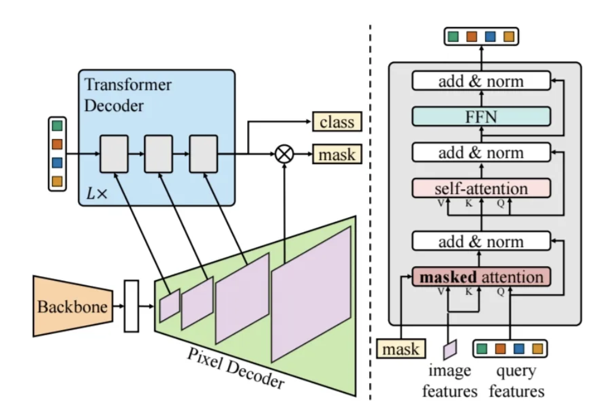
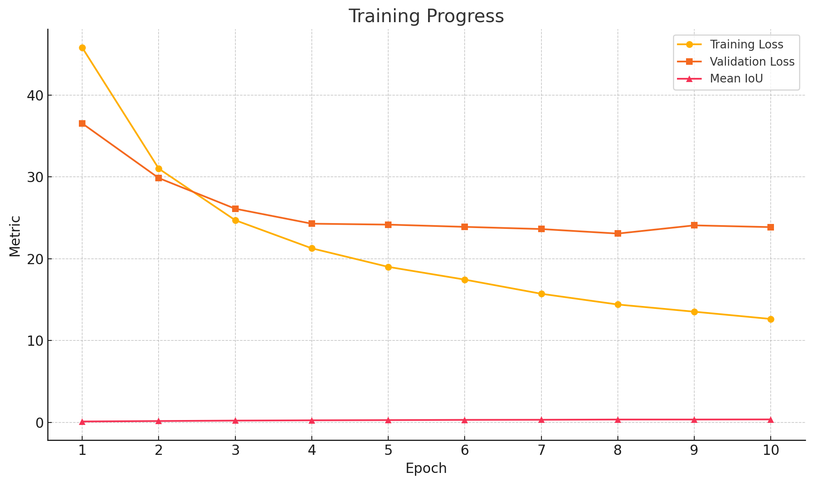

# 🧠 Food Calories Estimation
**음식 이미지에서 음식 객체 분리 + LLM 기반 설명 및 칼로리 예측 시스템**

> 음식 사진 속 객체를 분할(Segmentation)하고, 각 객체에 대한 자연어 설명과 칼로리 예측을 수행합니다.

---

## 📸 Demo 
  


---

## 💡 Motivation

이 프로젝트는 다음과 같은 실험적 시도와 시행착오를 기반으로 완성되었습니다:

- **Segment Anything Model (SAM)**, **Fast-SAM**, **DeepLabV3+** 등 다양한 segmentation 모델을 시도했지만, 음식 객체 간의 경계 구분이 미흡하거나 예측 라벨이 정확하지 않았습니다.
- 따라서, 음식에 특화된 dataset(FoodSeg103)에 fine-tuned 된 **Mask2Former** 모델을 한 번 더 fine-tuning하여 최종적으로 segmentation을 수행하였습니다.

---
### 🧠 What is Segmentation?

**Segmentation**은 이미지의 객체를 범위변에서 구분하고, 각 객체를 구분한 **마스크(mask)**를 발견하는 작업입니다.

사이즈나 형편이 비유한 건틀리를 box로 가리는 detection에 비해, segmentation은 **pixel 단위**로 정해진 범위를 구호합니다.

여기서 사용한 **semantic segmentation**은 객체들을 단순 라벨로 분리하는 방식입니다.

---
## 🔪 Model Overview  

본 프로젝트에서는 **Mask2Former**를 기반으로 음식 분할(Semantic Segmentation)을 수행합니다.

- **기반 모델**: [Mask2Former](https://arxiv.org/abs/2112.01527)[논문](https://arxiv.org/pdf/2112.01527)
- **데이터셋**: [FoodSeg103](https://huggingface.co/datasets/EduardoPacheco/FoodSeg103)
- **결과**: 음식 객체별 segmantation 마스크 및 lable 반환  
- **후처리**: LLM(Gemini)을 통해 자연어 설명 및 칼로리 예측

---

## 🔧 Model Architecture: Mask2Former

Mask2Former는 다음과 같은 구조로 구성되어 있습니다:



- **Backbone**: Swin Transformer 기반으로 hierarchical하게 feature를 추출합니다.
- **Pixel Decoder**: multi-scale feature를 통합하고 upsample하여 segmentation head로 전달합니다.
- **Transformer Decoder**: object query를 학습하며, 학습된 query에 대해 mask prediction을 수행합니다.
- **Segmentation Head**: binary mask 예측과 class 예측을 통해 최종 결과를 생성합니다.

---

## 🚀 주요 기능
- **Semantic Segmentation**: Mask2Former 기반 이미지 내 음식 분할
- **Gradio UI**: 웹 기반 이미지 업로드 및 결과 확인
- **Gemini API 연동**: 분할 결과 기반 자연어 설명 생성
- **모델 학습 기능**: Custom 학습 가능, yaml 기반 설정 파일 사용
- **모듈화된 구조**: 유지보수 및 기능 확장이 쉬운 구조로 설계

---

## 🚀 Project PipeLine

본 프로젝트는 음식 이미지를 입력으로 받아, **객체 분할**, **라벨 추출**, **LLM 기반 설명 및 칼로리 예측**까지 수행하는 구조입니다.

### 1️⃣ 이미지 입력 (Gradio UI)
- 사용자가 웹에서 이미지 업로드 또는 드래그&드롭
- 파일 경로가 `predict_masks()` 함수로 전달됨

### 2️⃣ 이미지 전처리
- `albumentations` 라이브러리를 통해 Resize(512x512), Normalize 수행
- OpenCV → NumPy → PyTorch Tensor 포맷으로 변환

### 3️⃣ Segmentation 모델 추론 (Mask2Former)
- Fine-tuned Mask2Former 모델을 로딩하여 추론 수행
- 출력: `segmentation mask` + `segments_info` + `label_id`

### 4️⃣ 시각화 처리
- 각 라벨에 맞는 색상으로 마스크 오버레이 생성
- PIL 이미지 객체에 텍스트(label name)까지 그려서 출력 이미지 생성

### 5️⃣ 라벨 추출
- `segments_info`에서 고유 `label_id`를 추출하여 중복 제거
- `id2label`을 통해 최종 라벨 이름 리스트 구성

### 6️⃣ Gemini API 호출
- 감지된 음식 라벨을 prompt에 삽입
- **Gemini-1.5-flash 모델**에 자연어로 질의
- 결과: 음식 종류 추론 + 평균 칼로리 포함된 텍스트 생성

### 7️⃣ 최종 출력
- Gradio UI에 결과 이미지(마스크 포함) + Gemini 응답 텍스트 함께 출력

---

## 📌 전체 흐름 요약

```text
[Input Image]
     ↓
[Preprocessing]
     ↓
[Mask2Former Inference]
     ↓
[Segmentation Mask + Label Extraction]
     ↓
[LLM Prompt (Gemini)]
     ↓
[Food Name + Estimated Calorie]
     ↓
[Gradio UI Output]
```

---

## 🔧 사용법

### 1. 프로젝트 구조
```
FoodSeg/
├── gradio_app/
│   ├── app.py                  # Gradio UI
│   └── model_inference.py      # mask 예측 함수
├── scripts/
│   └── train.py                # SegmentationTrainer 정의 (학습 로직)
│   └── run_training.py         # 모델 학습 스크립트
├── config.yaml                 # 학습 설정
├── foodseg_result/             # (학습된 모델 저장 경로)
└── README.md
```

### 2. 학습

```bash
python -m scripts.run_training --config configs/semantic/pipeline.yaml
```

> Checkpoint는 `foodseg_result/` 하위에 `.pth` 파일로 저장됨

### 3. 실행

```bash
python gradio_app/app.py
```

> Gradio UI를 통해 이미지 입력 시 마스크 결과 + 자연어 설명 + 칼로리 예측까지 확인 가능

---
## 📂 데이터셋 구성

- **이름**: FoodSeg103 (HuggingFace에서 사용 가능)

- **Train 데이터 수**: 약 6,000장

- **Validation 데이터 수**: 약 1,600장

- **총 클래스 수**: 104개 (음식 종류별 고유 라벨 포함)

### 🏷️ 라벨 (id2label 포맷)

FoodSeg103 데이터셋은 다음과 같은 형식의 라벨을 포함합니다:

- 0: background

- 1: apple

- 2: banana

- 3: fried rice

...

- 103: yogurt


각 이미지의 픽셀은 이 라벨 ID에 해당하는 값을 가지며, `.json` 형식으로 제공되는 라벨 매핑 파일(`id2label.json`)을 통해 사람이 읽을 수 있는 라벨명으로 변환됩니다.

> 예: `id2label[3]` → `"fried rice"`

---

## 🧪 코드 구성 및 설명

### 1. `gradio_app/model_inference.py`
- **목적**: 사용자 이미지 업로드 시 segmentation 예측 + Gemini 설명 생성
- **구성 기능**:
  - `load_model_and_processor()`: 가장 최신 checkpoint 불러오기
  - `predict_masks()`: 이미지 전처리, 모델 추론, 마스크 시각화 수행
  - `generate_caption_from_labels_with_calories()`: 인식된 라벨을 기반으로 Gemini API 호출하여 텍스트 생성

### 2. `scripts/run_training.py`
- **목적**: 학습 설정을 담은 `config.yaml`을 불러와 FoodSeg103 데이터셋으로 Mask2Former 모델 학습 수행
- **주요 기능**:
  - `load_config()`: yaml 로부터 설정 로딩
  - HuggingFace Hub에서 `id2label` 및 `train/val dataset` 다운로드
  - `SegmentationTrainer` 인스턴스 생성 및 학습 시작

### 3. `scripts/train.py`
- **목적**: 학습 로직이 정의된 클래스 `SegmentationTrainer` 구현
- **주요 기능**:
  | 기능 | 설명 |
  |------|------|
  | 데이터 로딩 및 전처리 | `Albumentations` 이용해 Resize, Normalize, Flip 등 적용 |
  | 모델 초기화 | 사전학습된 `mask2former-swin-small-ade-semantic` 불러옴 |
  | 학습 루프 | Epoch별 학습, Loss 기록, Validation 포함 |
  | 평가 지표 | mean IoU(`evaluate` 라이브러리) 사용 |
  | 모델 저장 | `save_pretrained()` + `.pth` 로 저장 |
  | 시각화 | `tensorboard` 연동 로그 저장 |

---

## 📈 Training Performance Summary

| Epoch | Avg Training Loss | Validation Loss | Mean IoU |
|-------|-------------------|------------------|----------|
| 1     | 45.7836           | 36.5247          | 0.1157   |
| 2     | 31.0042           | 29.8534          | 0.1727   |
| 3     | 24.7041           | 26.1080          | 0.2254   |
| 4     | 21.2724           | 24.2801          | 0.2612   |
| 5     | 19.0046           | 24.1669          | 0.2853   |
| 6     | 17.4488           | 23.8930          | 0.3119   |
| 7     | 15.7188           | 23.6258          | 0.3249   |
| 8     | 14.4083           | 23.0735          | 0.3544   |
| 9     | 13.5278           | 24.0761          | 0.3561   |
| 10    | 12.6420           | 23.8619          | 0.3682   |
| 11    | 11.8512           | 24.0698          | 0.3666   |
| 12    | 11.0688           | 25.3515          | 0.3584   |
| 13    | 9.5226            | 24.1838          | 0.3879   |
| 14    | 9.0237            | 24.4087          | 0.3961   |

- **Model Checkpoints Saved:** Epoch 1 ~ 14 
- **📌 Best Epoch:** **Epoch 8** — Lowest Validation Loss `23.0735` with high IoU `0.3544`

---
### 📊 Loss 및 IoU 시각화 결과



- 좌측 그래프는 **Training Loss vs Validation Loss**의 변화를 나타냅니다.
- 우측은 **Mean IoU**가 Epoch별로 점진적으로 상승하는 양상을 보여줍니다.
- Epoch 1부터 빠르게 성능이 개선되며, Epoch 8에서 가장 낮은 Validation Loss와 높은 IoU 성능을 기록했습니다.

---

## ⚠️ 한계점

- 초기에는 다양한 모델 (SAM, Segment Anything 등) 시도했으나,  
  음식 세그먼트에 적합하지 않아서 최종적으로 Mask2Former 참조
- 정확한 칼로리 계산을 위해서는 실제 물리 크기나 무게 정보가 필요하지만,  
  현재는 단순 **라벨 기반 대략 예측** 수준
- Segmentation의 pixel 값과 depthmap을 함께 사용해 실제 음식 크기를 추정하고 칼로리를 예측하려 했으나,  
  구현 단계에서는 정확한 depth 정보와의 정합이 어려웠음
- **라벨 클래스 수가 제한적임 (총 104개 클래스)**  
  → 실제 존재하는 수천 가지 음식 종류를 모두 커버하지 못함  
  → 예: 김치찌개, 떡볶이, 잡채 등의 **일상적 한국 음식은 미포함**  
  → 이로 인해 **분류 불가능하거나 부정확한 예측**이 발생할 수 있음
---

## 🚧 향후 계획

- Fine-tuning 데이터셋 증가
- 실제 칼로리 계산을 위한 depth estimation 또는 reference scaling 도입

---
